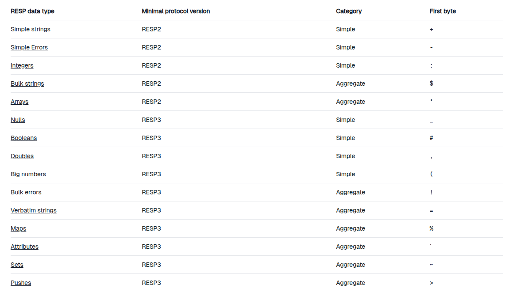

#### RESP Redis Serialization Protocol
RESP is a binary protocol that uses binary sequences encoded in standard ASCII.

The first byte in RESP-serialized payload always identifies its type



##### How Redis command work
SET admin tl

```*3\r\n$3\r\nset\r\n$5\r\nadmin\r\n$5\r\ntl```

*3 - * indicates array
$3 - $ bulk string with strings length -3
set
$5
admin
$5
ahmed


#### Redis persistence

##### RDB Redis Database
performs point in time snapshots of your database at specified intervals

###### Advantages
🗂️ Compact Single File
- Point-in-time snapshot — ideal for backups and archiving.
- Easy to store, transfer, or upload (e.g., to AWS S3).

🌍 Disaster Recovery Ready
- Can be transferred across data centers for redundancy.

⚡ High Performance
- Only forks a child process; no disk I/O by the parent.
- Minimal impact on Redis during persistence.

🚀 Fast Restarts (Big Datasets)
- Binary snapshot allows quick loading into memory.
- RDB allows faster restarts with big datasets as compared to AOF


🔁 Replica Resync Support
- Supports partial resynchronization after failovers or restarts.


###### ❌ Disadvantages
⚠️ Potential Data Loss
- Snapshots typically every few minutes → recent data may be lost on crash.

🐘 Fork Overhead
- Frequent fork()s needed; on large datasets, can cause latency spikes.

🕔 Fixed Save Points
- Configurable (e.g., every 5 mins/100 writes), but not real-time durability.


##### AOF
Logs every write operation. These operations can be replayed again at server startup reconstructing the original database

###### ✅ Advantages
🛡️ Higher Durability
- Configurable fsync policies:
  - always, every second (default), or no fsync.

✍️ Append-Only Log
- No disk seeks → safer during power loss.
- Easily fixable via redis-check-aof if corruption occurs.

🔄 Automatic Log Rewrite
- Periodic rewrite reduces file size; safe and non-blocking.

🔍 Human-Readable & Editable
- Log of all commands — easy to parse, debug, and even recover from mistakes (e.g., undo accidental FLUSHALL).


###### ❌ Disadvantages
💾 Larger File Size
- Typically bigger than RDB for the same dataset.

🐢 Slower Restarts (Big Datasets)
- Redis must replay all commands to rebuild state.

⚙️ Performance Depends on fsync
- fsync every second: Good performance but slightly slower than RDB.
- fsync always: Lower performance, higher durability.
- Higher latency under heavy write load compared to RDB.

## 🔍 Summary Table: RDB vs AOF

| Feature                  | RDB                                     | AOF                                      |
|--------------------------|-----------------------------------------|------------------------------------------|
| Durability               | ❌ Less (snapshot-based)                | ✅ High (append-only, fsync support)     |
| Performance              | ✅ High (minimal I/O by parent)         | ⚠️ Varies (based on fsync policy)         |
| Restart Speed (Big Data) | ✅ Fast (binary load)                   | ❌ Slower (command replay)               |
| File Size                | ✅ Smaller                              | ❌ Larger                                |
| Recovery Flexibility     | ❌ Limited                              | ✅ Editable, human-readable              |
| Fork Overhead            | ❌ Frequent `fork()` for snapshots      | ✅ Less frequent `fork()` (rewrite only) |
| Ideal Use Case           | Backups, disaster recovery              | High durability, minimal data loss       |
